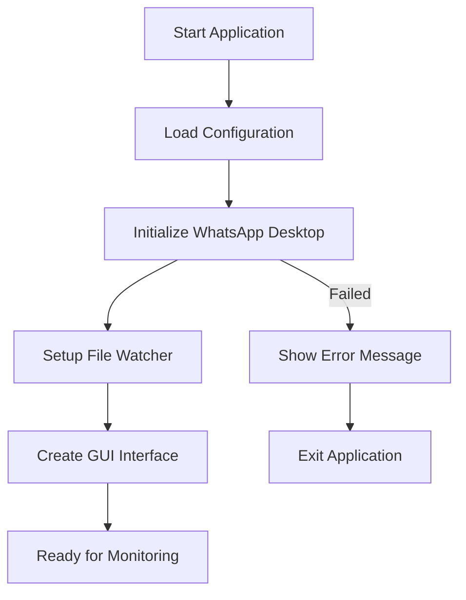
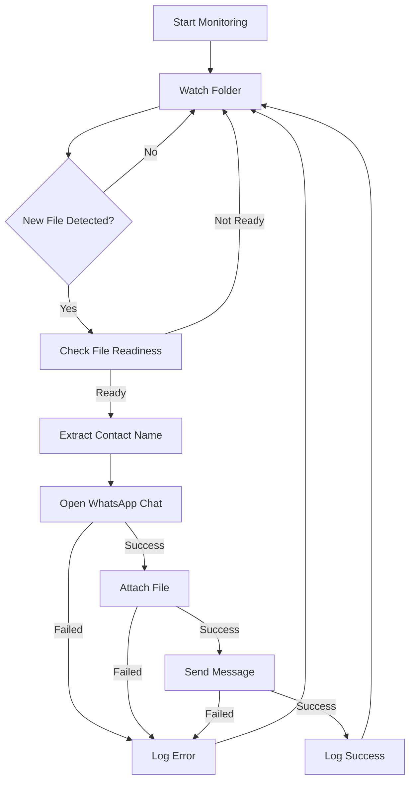
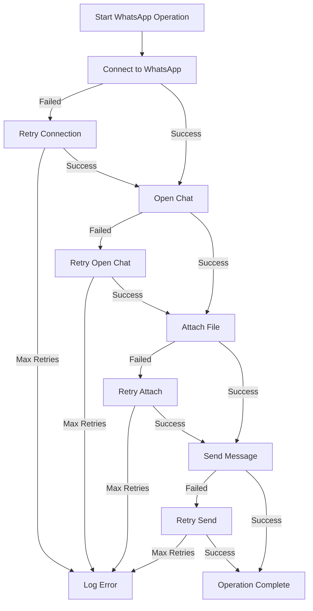
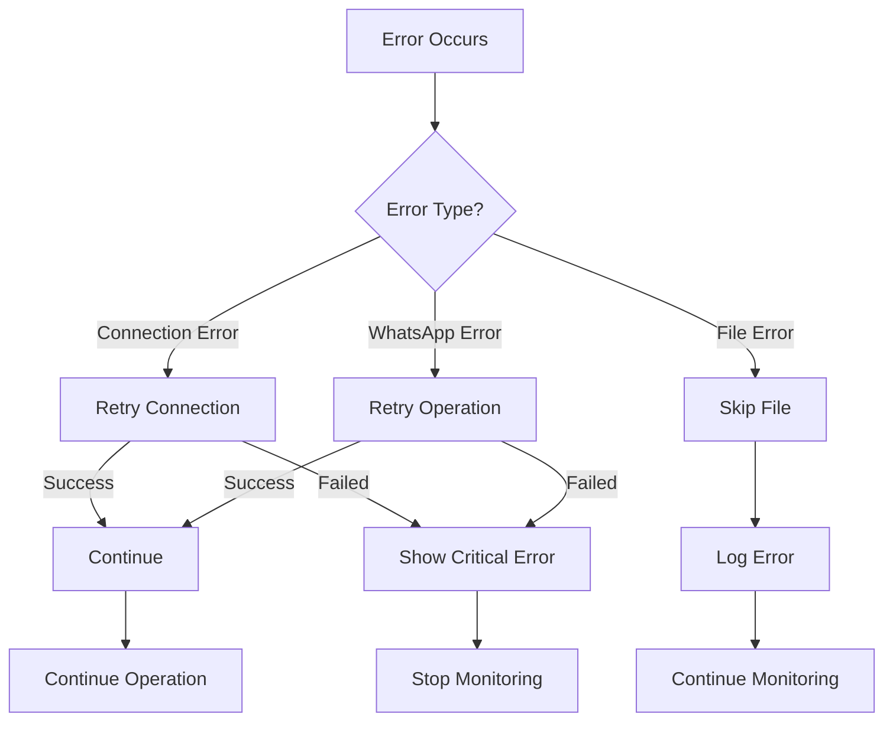
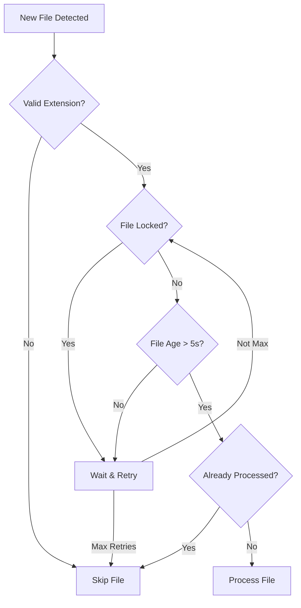
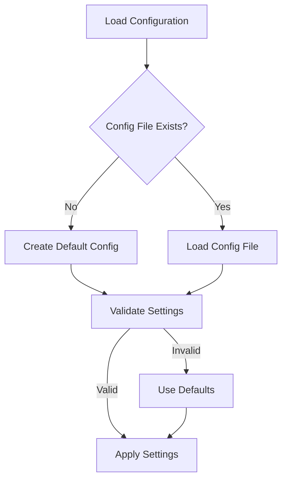
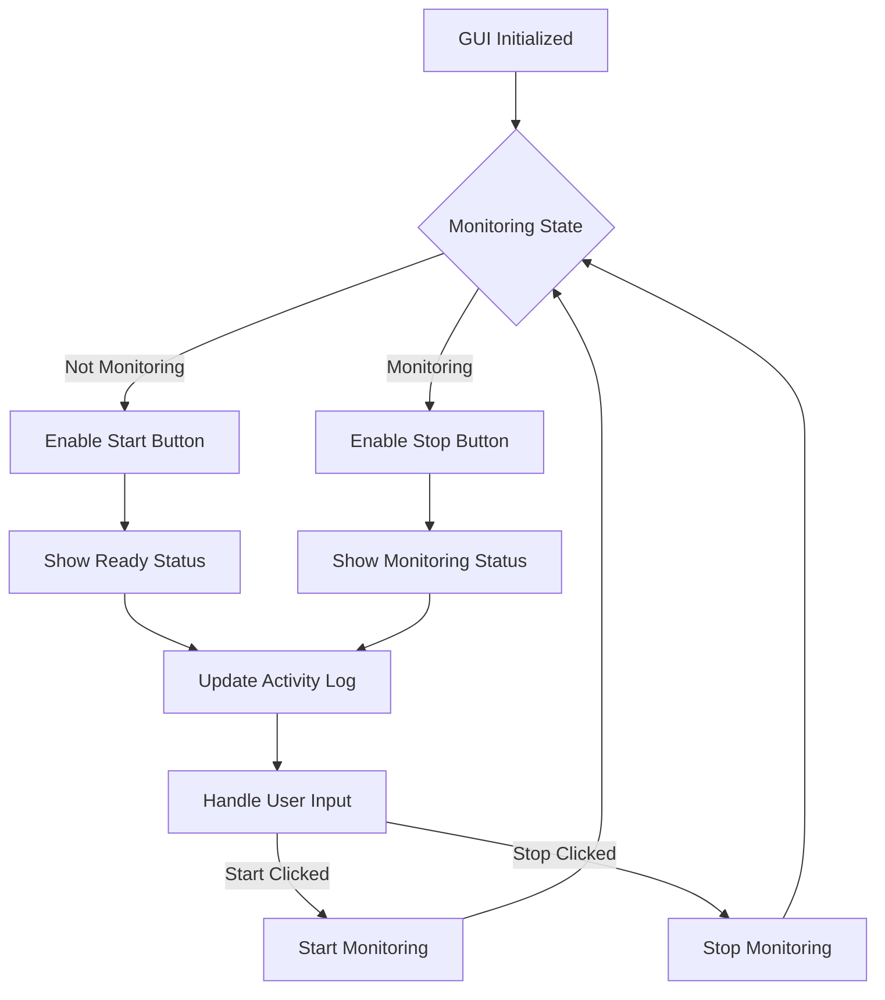

# WhatsApp Auto Sender - Flow Charts

## 1. Application Initialization

## 2. File Monitoring Process

## 3. WhatsApp Automation Flow

## 4. Error Handling Flow

## 5. File Processing Decision Tree

## 6. Configuration Management

## 7. GUI State Management
